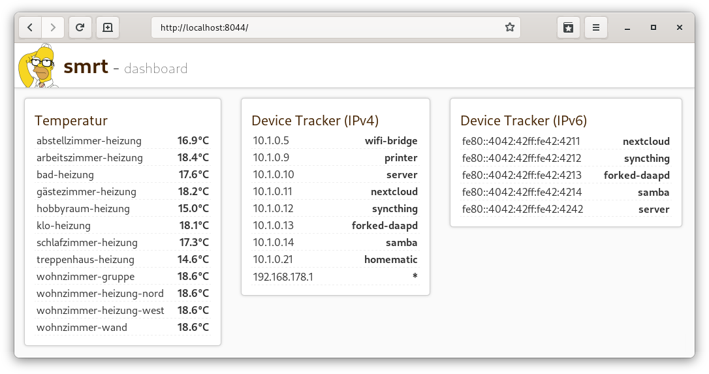

# smrt

**WARNING: Under development and not ready yet.**

This project aims to be an mqtt home dashboard and automation trigger (*TBD*). Its goal is to listen on a specified [MQTT](https://mqtt.org/) broker, automatically adding known devices to the [dashboard](#dashboard) and trigger [automations](#automations) based on the given script files (*TBD*).

## Install

    git clone https://github.com/shagu/smrt.git
    cd smrt
    npm install mqtt
    node smrt.js

## Dashboard

The dashboard is served on [localhost:8044](http://localhost:8044) and receives a viewport prepared by the `smart.js` backend. The view is sent to the dashboard via socket.io but can also be reviewed on [localhost:8044/json](http://localhost:8044/json) for debugging reasons.



## Devices

Known devices can be added to the devices folder. Have a look at [homematic.js](devices/homematic.js) and [openwrt.js](devices/openwrt.js) to see examples. A valid device configuration must contain the MQTT topic pattern that it should trigger on, aswell as a `getData` function that returns an object containing:

### Core entries

- `uid`: a unique identifier of the device/entry
- `category`: a section name to group the device
- `device`: a name for the given device

### Dashboard entries

You can use "$var" to access other variables of the same device object. (e.g use "$uid" to display the uid entry.)

- `name`: this will appear in the left pane of the dashboard
- `value`: this will appear in the right pane of the dashboard

### Custom entries

You can add custom fields to anything your device needs, make sure to not use any conflicting names with the mentioned above.

### Example device

Here's an example to display homematic temperatures on the dashboard ([devices/homematic.js](devices/homematic.js)):

```js
exports.device = {
  name: 'homematic',
  topics: {
    /* actual temperatures */
    '^hm/status/(.+):[0-9]/ACTUAL_TEMPERATURE$': {
      getData: (topic, msg) => {
        let name = topic.match('^hm/status/(.+):[0-9]/ACTUAL_TEMPERATURE$')[1]
        let value = JSON.parse(msg).val.toFixed(1)
        let category = "temperature"

        const data = {
          1: {
            /* device data */
            uid: hash(category + name),
            category: category,
            device: name,

            /* dashboard */
            name: "$device",
            value: "$current°C ($target°C)",

            /* custom data fields */
            current: value,
          }
        }

        return data
      }
    }
  }
}
```

## automations (TBD)

tbd